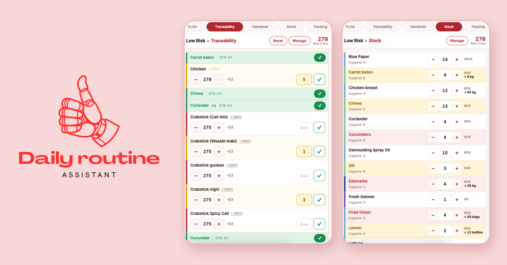

# Daily routine assistant

A password-protected, mobile-first web app I built to speed up my daily routine as Assistant Lead at a food production site. It replaces paper notes, mental math and retyped WhatsApp messages with a few taps on the phone.

**Live:** https://lautaroreche.github.io/daily-routine-assistant/ (password required)

**Version:** 2.17.0

## Sections

### 🗓️ Roster
The weekly work roster, ready to read and zoom on the phone. A base roster ships with the app; uploading a newer PDF or photo on the phone takes priority. Shows how old the current roster is.

### To Do
Opens by default.
- **Daily tasks** that come back unticked every day, and **weekly tasks** due on their day; a Daily / Weekly switch shows one or the other (Daily by default, Weekly shows how many are due today).
- **Extra tasks** added on the fly; they stay until ticked.
- Ticked tasks move to a collapsed **Done** section instead of being deleted.
- *Manage*: add, edit, reorder or remove fixed tasks, and set each one as Daily or Weekly (with its day).

### Traceability
Morning picking of ingredients for the production team.
- Same filters as Stock: place (with the items still to do in each), suppliers checklist and A–Z / Sheet order; supplier and place shown under each item, shared with Stock.
- Batch codes in Julian date format (`DDD-SS`) with a fixed supplier suffix per item; adjust with `+` / `−` or type the day.
- Several batches per item when needed; each new day starts with only the newest one.
- **Given** box for the quantity handed over so far, done tick, and items pinned as *always done*.
- kg → boxes calculator for items requested by weight.
- *Manage*: add, rename or remove items, change supplier codes, pin always-done items.

### Handover
Shift handover report for the WhatsApp group.
- Guided form with dropdowns, chips and checkboxes; required fields are checked before copying.
- Business rules built in (rice steps in order, lines merged by round, identical statuses grouped).
- The header switches automatically from the *estimated* report to the final one once the report time has passed (14:00, or 14:30 on Saturdays).
- A Reset button (two taps) brings the form back to its defaults once something has changed.
- Everything returns to its defaults every day.

### Stock
Daily stock count of every product on the paper stock sheet.
- Starts from the previous day's count; `+` / `−` or type the number.
- Place selector (All, Fridge, Goods in, Warehouse) with the number of products in each, to count one area at a time.
- Suppliers button that opens a checklist (main suppliers ticked by default), combinable with the place.
- A–Z by default, with a Sheet option that follows the paper stock sheet to copy the numbers easily.
- Unit per product and automatic equivalences (e.g. `3 BOX = 13.5 kg`).
- Reorder points: products turn yellow when close and red when below.
- *Manage*: unit, place, reorder point and equivalence per product; add or remove products.

### Packing
- **Picklist**: trays, boxes and other packaging, colour-coded by type, with carton photos, flat and assembled photos of the boxes (with a size reference) and an overview photo of all trays.
- **Sushi**: every sushi tray with its photo and contents (pieces in bold); missing photos are flagged.
- **Packing**: the packings of each client, with the cardboard box they go in and the sushi trays they carry (quantity and tray size).
- *Manage* in every tab: rename, edit contents or details, change the type and colour, add or remove items, and take or replace photos.

## How it works
- A single self-contained HTML file: plain HTML, CSS and vanilla JavaScript. No backend, no build step for the user, no dependencies other than the Inter font and pdf.js (loaded only when a PDF roster is uploaded).
- Each section is an isolated module (scoped CSS, independent state); an error in one section can't break the others.
- **Base data and app logic are separate.** Everything fixed (daily tasks, items with minimum batch codes, stock settings, packing catalogue and photos, roster) lives in a base data file that is embedded into the app when it is built. A new base version updates every phone while keeping what was added on the phone itself. The base file is kept private and is not part of this repository.
- Day-to-day data is stored on the device (`localStorage`, and IndexedDB for photos). It never leaves the phone.
- The published page is encrypted with [StatiCrypt](https://github.com/robinmoisson/staticrypt) (AES-256): the repository only contains ciphertext. Sessions last 10 hours; the log-out button at the end of the tab bar forgets the password on that phone without touching the data.
- Open Graph tags and `preview.png` give the link a proper preview when shared.

## Usage
Open the link on the phone, log in, and add it to the home screen (Chrome: ⋮ menu → *Add to Home screen*).

When clearing the browser history, untick *Cookies and site data* to keep the app's data.

## Repository
- `index.html` — the encrypted app
- `about.html` — public presentation page used for sharing (LinkedIn, etc.)
- `preview.png` — image for shared-link previews
- `screens/` — screenshots used on the about page (sensitive data hidden)
- `README.md`

To update, replace `index.html` with the new encrypted version and commit; GitHub Pages redeploys in a minute or two.
